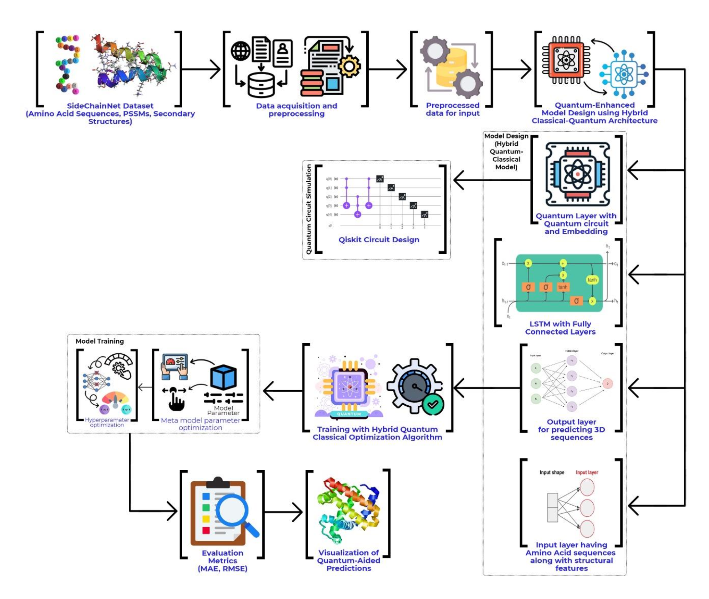
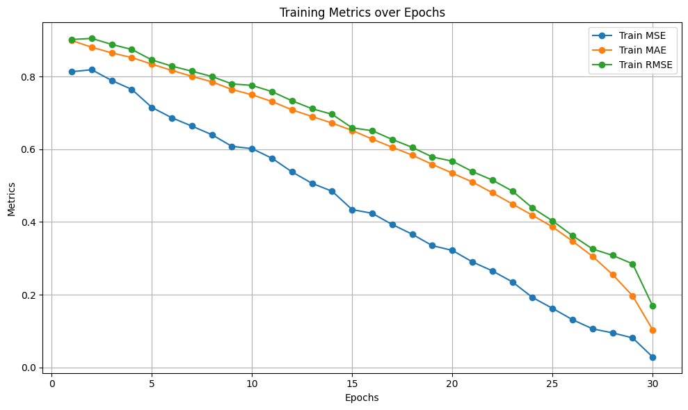
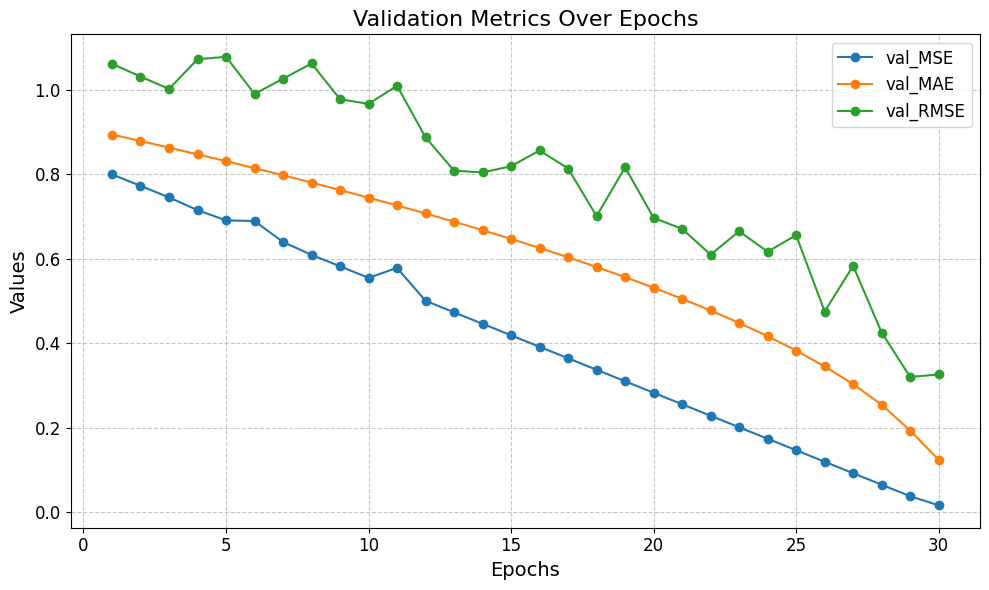
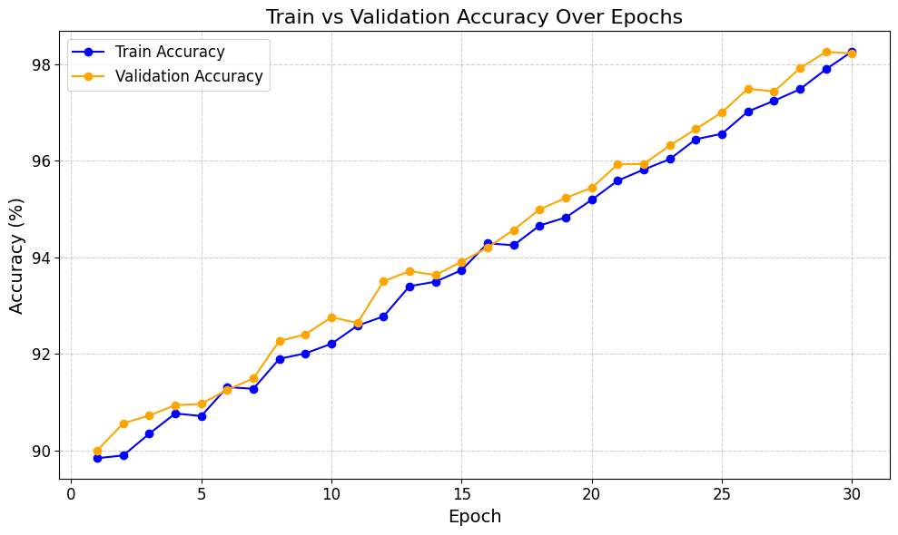
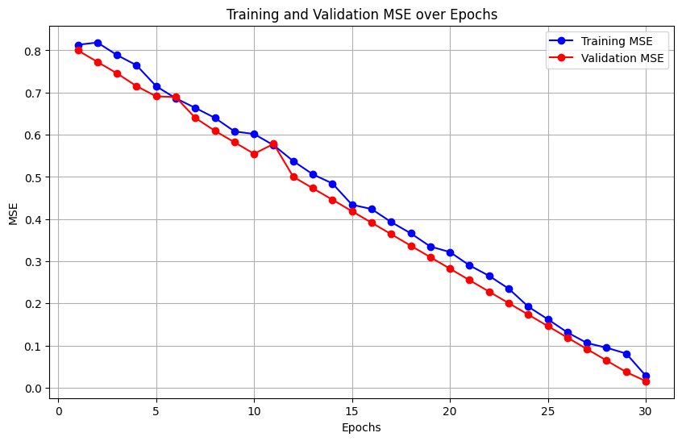
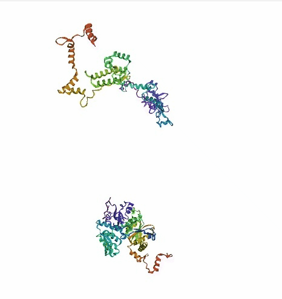
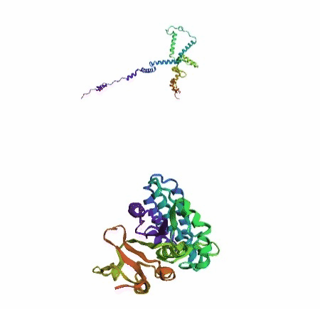
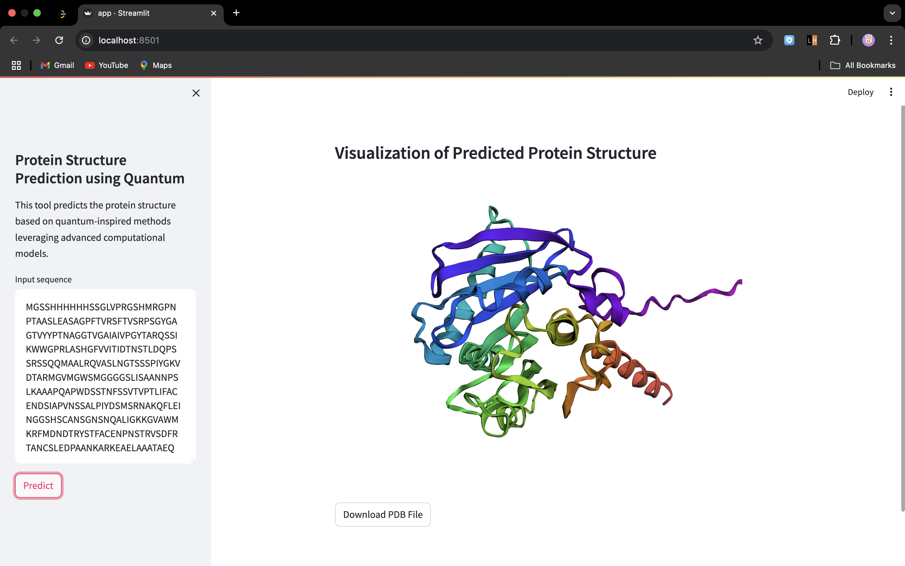

# QuantumFold: Hybrid Quantum-Classical Deep Learning for Protein Folding Prediction

QuantumFold is a computational framework that combines quantum circuits and classical deep learning to enhance protein folding prediction. By leveraging the power of quantum computing, this project aims to tackle complex protein structure problems.

## Features

- **Hybrid Architecture**: Quantum circuits integrated with classical LSTM layers.
- **Quantum Computing**: Parameterized quantum circuits implemented using Qiskit.
- **Comprehensive Metrics**: Logs training and validation performance.
- **Protein Dataset**: Utilizes the SidechainNet dataset.
- **Data Visualization**: Clear and concise metric plots.

## Tech Stack

- Python
- TensorFlow
- Qiskit
- NumPy
- Matplotlib
- Pandas
- SidechainNet

## Getting Started

### Prerequisites

Ensure you have Python installed. Install the required packages:

```bash
pip install -r requirements.txt
```
## Usage
1. Clone the repository:
```bash

git clone https://github.com/yourusername/quantumfold.git
cd quantumfold
```

2. Train the model:
```bash
python train.py
```

3. Visualize the metrics:
```bash
python visualize_metrics.py
```

4. The trained model is saved as model.h5.

5. To run the app use:
```bash
streamlit run app.py
``` 

## Architecture



## Results

After training, you can visualize metrics such as Mean Squared Error (MSE), Mean Absolute Error (MAE), and accuracy over epochs.





The protein struture is predicted in a 3-D gif format. As shown below:



Also the repo consists of the frontend code developed in streamlit in file app.py which looks as the image attached below:

